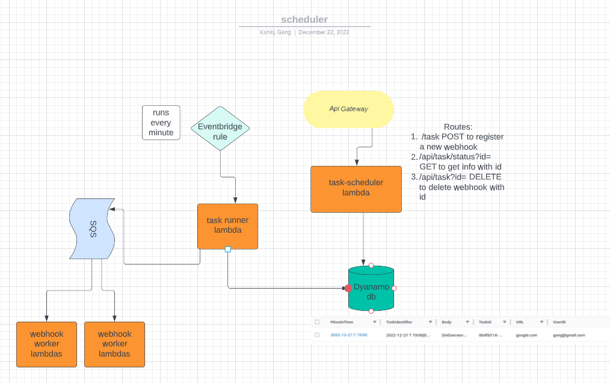
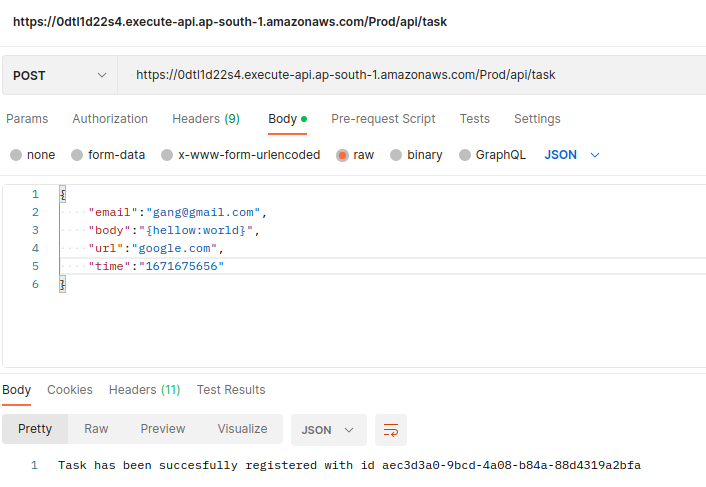

# 

Serverless Scheduling application made using aws lambda,dynamo db,aws sqs and aws eventbridge. \
The project uses aws sam cli to deploy all the aws services.


AWS Architecture Diagrams



To run the application on your aws account -
1. Please rename all the functions and aws resources in template.yaml.( Rename the table and queue names in appropriate lambda function code).Also install the aws sam cli.
2. ```sam build```
3. ```sam deploy --guided```
4. Generate an api key for the usage plan of the api gateway.( The request contains the values as the X-API-Key header. API Gateway then validates the key against a usage plan. )

Example request using postman-



based on

https://aws.amazon.com/blogs/architecture/serverless-scheduling-with-amazon-eventbridge-aws-lambda-and-amazon-dynamodb/